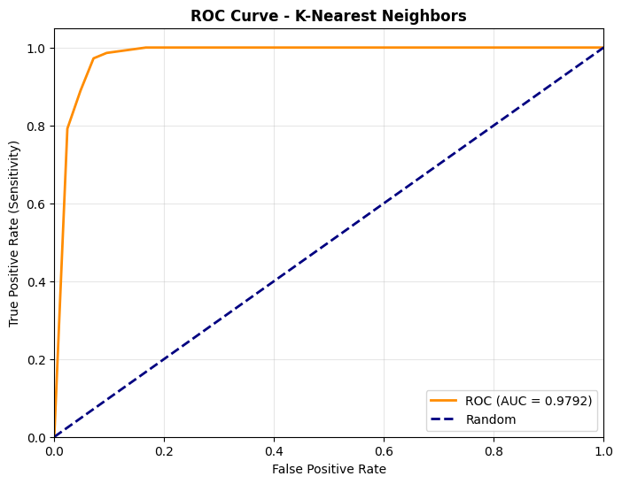

# 🧠 Breast Cancer Detection using K-Nearest Neighbors (KNN)


> A machine learning project predicting breast cancer diagnosis using the **UCI Breast Cancer Wisconsin (Diagnostic) dataset**.  
> Focus: Accuracy, interpretability, and healthcare impact through explainable AI models.

---

## 📋 Table of Contents
1. [Project Overview](#project-overview)
2. [Dataset Information](#dataset-information)
3. [Model Development](#model-development)
4. [Results & Evaluation](#results--evaluation)
5. [Visualization](#visualization)
6. [How to Run This Project](#how-to-run-this-project)
7. [Key Learnings](#key-learnings)
8. [Future Improvements](#future-improvements)

---

## 🚀 Project Overview

This project uses **K-Nearest Neighbors (KNN)** to classify tumors as *malignant* or *benign* based on diagnostic features.  
It demonstrates data preprocessing, model training, evaluation, and visualization — showing how AI can assist healthcare decision-making.

- **Goal:** Early breast cancer detection through pattern recognition  
- **Approach:** Supervised learning (Classification)  
- **Duration:** 5 days (End-to-end implementation and testing)  

---

## 🧩 Dataset Information

- **Source:** [UCI Machine Learning Repository – Breast Cancer Wisconsin (Diagnostic)](https://archive.ics.uci.edu/ml/datasets/Breast+Cancer+Wisconsin+%28Diagnostic%29)
- **Samples:** 569
- **Features:** 30 numeric attributes (radius, texture, smoothness, etc.)
- **Target Classes:**  
  - **M (Malignant)**  
  - **B (Benign)**  

**Train-Test Split:** 80% train / 20% test

---

## 🧠 Model Development

- **Algorithm:** K-Nearest Neighbors (KNN)
- **Libraries Used:**  
  `scikit-learn`, `pandas`, `numpy`, `matplotlib`, `seaborn`

**Steps:**
1. Data Cleaning and Normalization  
2. Exploratory Data Analysis (EDA)  
3. Model Training (Grid Search for optimal k value)  
4. Model Evaluation and Visualization  

---

## 📊 Results & Evaluation

| Metric | Score |
|:-------|:------:|
| **Accuracy** | 0.9561 (95.6%) |
| **Precision** | 0.9589 (95.9%) |
| **Recall** | 0.9722 (97.2%) |
| **F1-Score** | 0.9655 (96.6%) |
| **ROC-AUC** | 0.9792 |

✅ The model achieved strong generalization with minimal overfitting.  
✅ Excellent recall — ideal for healthcare prediction where **false negatives** are critical.  

---

## 📈 Visualization


*ROC Curve showing AUC = 0.9792, confirming high model sensitivity and specificity.*

---

## 💡 Key Skills Demonstrated
- **Data Cleaning & Feature Engineering** – Pandas, NumPy  
- **Model Development & Optimization** – Scikit-learn (KNN, GridSearchCV)  
- **Performance Evaluation** – ROC-AUC, F1-score  
- **Exploratory Data Visualization** – Matplotlib, Seaborn  
- **Healthcare Data Interpretation & Insight Communication**

---

## 🩺 Business / Clinical Impact
> This model demonstrates how **data-driven analytics** can support early breast cancer detection, enabling clinicians to make more confident, accurate, and timely diagnoses — potentially saving lives through early intervention.

---

## 🚀 Tools & Libraries
`Python` • `Pandas` • `NumPy` • `Scikit-learn` • `Matplotlib` • `Seaborn` • `Google Colab`

---

## 🧭 Future Work
- Integrate ensemble models (XGBoost, LightGBM)  
- Apply **explainable AI (XAI)** techniques (SHAP, LIME)  
- Deploy via **Streamlit web app** for interactive demo  

---

## 👤 Author
**Ryan Tan**  
🎯 Mid-Career Data Science Trainee | Healthcare & Business Analytics Enthusiast  
📍 Singapore  
🔗 [LinkedIn Profile](https://www.linkedin.com/in/coachryantan) | [Google Colab Notebook](https://colab.research.google.com/drive/1TlaEw21uaWot2h3rbGLBf_NgnZo8naCa?usp=sharing)

---

## ⚙️ How to Run This Project

You can run this project on **Google Colab** or locally on your machine.

### Option 1: Run on Colab
1. Open this notebook:  
   👉 [Run on Google Colab](https://colab.research.google.com/drive/1TlaEw21uaWot2h3rbGLBf_NgnZo8naCa?usp=sharing)
2. Click **Runtime → Run all**
3. View the model metrics and ROC curve output

### Option 2: Run Locally
```bash
# 1. Clone this repository
git clone https://github.com/yourusername/Breast-Cancer-Detection.git
cd Breast-Cancer-Detection

# 2. Install dependencies
pip install -r requirements.txt

# 3. Run the notebook
jupyter notebook Breast_Cancer_Detection.ipynb
